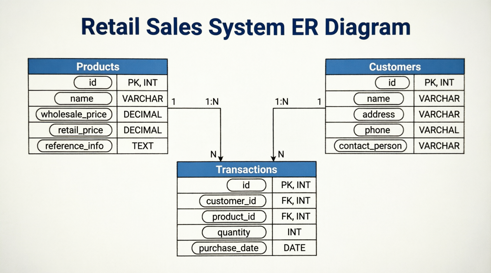

# Лабораторная работа №1: Реализация готовой продукции

## Тема предметной области
Оптово-розничная торговля товарами

## ER-модель предметной области (3НФ)

### Сущности:

#### 1. Products (Товары)
- **id** (PK, INT) - уникальный идентификатор
- **name** (VARCHAR) - наименование товара
- **wholesale_price** (DECIMAL) - оптовая цена
- **retail_price** (DECIMAL) - розничная цена
- **reference_info** (TEXT) - справочная информация

#### 2. Customers (Покупатели) ⭐ ВЫБРАНА ДЛЯ ЛР
- **id** (PK, INT) - уникальный идентификатор
- **name** (VARCHAR) - наименование покупателя
- **address** (VARCHAR) - адрес
- **phone** (VARCHAR) - телефон
- **contact_person** (VARCHAR) - контактное лицо

#### 3. Transactions (Сделки)
- **id** (PK, INT) - уникальный идентификатор
- **customer_id** (FK → Customers.id)
- **product_id** (FK → Products.id)
- **quantity** (INT) - количество
- **purchase_date** (DATE) - дата покупки

### Связи:
- **Customers ↔ Transactions**: 1:N (один покупатель - много сделок)
- **Products ↔ Transactions**: 1:N (один товар - много сделок)

### Обоснование выбора сущности:
Выбрана сущность **Customers**, так как она имеет наибольшее количество полей (5 полей) среди независимых сущностей.