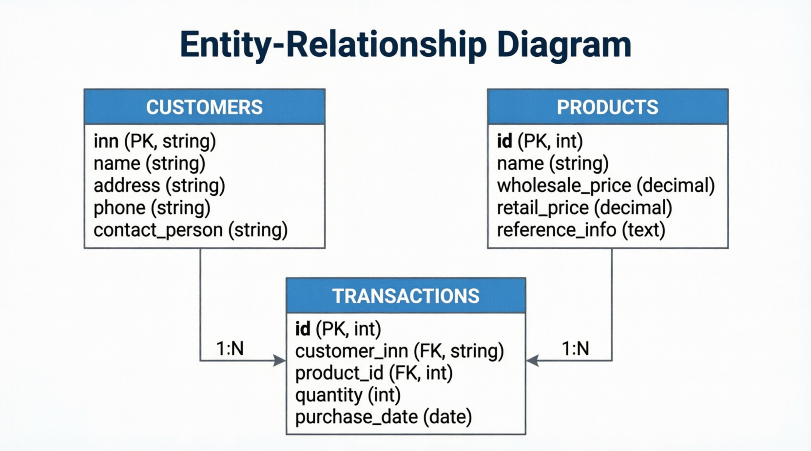

# Лабораторная работа №1: Реализация готовой продукции

## Тема предметной области
Оптово-розничная торговля товарами. Отслеживание финансовой стороны работы компании: учёт товаров, покупателей и документов по сделкам.

---

## 1. ER-модель предметной области (3НФ)

Модель состоит из 3 таблиц, приведённых к Третьей нормальной форме (3НФ): все неключевые атрибуты зависят от первичного ключа, нет транзитивных зависимостей и повторяющихся групп.

### Таблица 1: Products (Товары)
| Поле | Тип | Описание |
|------|-----|----------|
| `id` | INT (PK) | Уникальный идентификатор товара |
| `name` | VARCHAR | Наименование товара |
| `wholesale_price` | DECIMAL | Оптовая цена |
| `retail_price` | DECIMAL | Розничная цена |
| `reference_info` | TEXT | Справочная информация о товаре |

### Таблица 2: Customers (Покупатели)  *Выбрана для ЛР1-ЛР4*
| Поле | Тип | Описание |
|------|-----|----------|
| `inn` | VARCHAR (PK) | **ИНН организации** — уникальный бизнес-ключ (10 или 12 цифр) |
| `name` | VARCHAR | Наименование покупателя (организации/ИП) |
| `address` | VARCHAR | Юридический/фактический адрес |
| `phone` | VARCHAR | Контактный телефон |
| `contact_person` | VARCHAR | ФИО контактного лица |

> **Примечание:** В качестве первичного ключа используется `inn` (бизнес-ключ), а не абстрактный `id`. Это реальный уникальный идентификатор юридического лица в РФ, что соответствует лучшим практикам проектирования БД.

### Таблица 3: Transactions (Документы/Сделки)
| Поле | Тип | Описание |
|------|-----|----------|
| `id` | INT (PK) | Уникальный идентификатор документа |
| `customer_inn` | VARCHAR (FK) | Внешний ключ → `Customers.inn` |
| `product_id` | INT (FK) | Внешний ключ → `Products.id` |
| `quantity` | INT | Количество купленного товара |
| `purchase_date` | DATE | Дата совершения покупки |

### Связи между сущностями
- **Customers ↔ Transactions**: `1:N` (один покупатель совершает множество сделок).
- **Products ↔ Transactions**: `1:N` (один товар участвует в множестве сделок).

### Обоснование выбора сущности
Выбрана сущность **Customers** — она независимая и имеет наибольшее количество полей (5 полей), что позволяет полноценно продемонстрировать инкапсуляцию, валидацию и перегрузку конструктора.

---

## 2. Архитектура решения

Реализация построена на принципах ООП и паттернах проектирования:

- **Инкапсуляция** — все поля `Customer` приватные (`_inn`, `_name`, ...), доступ только через `@property` и сеттеры с валидацией.
- **Паттерн Factory Method** — логика парсинга из разных форматов (JSON, строка) вынесена в отдельный класс `CustomerFactory`. Сам `Customer` знает только один универсальный способ создания — `from_dict()`.
- **Паттерн Adapter (через композицию)** — `CustomerShort` не наследует `Customer` (это нарушало бы принцип подстановки Лисков), а содержит ссылку на объект `Customer` и предоставляет упрощённый интерфейс только к нужным полям (ИНН и наименование).
- **Принцип единственной ответственности (SRP)** — каждый класс отвечает за одну задачу:
  - `Customer` — хранение и валидация данных покупателя.
  - `CustomerValidator` — статические методы проверки полей.
  - `CustomerFactory` — создание объектов из внешних форматов.
  - `CustomerShort` — краткое представление данных.

---

## 3. Структура проекта
├── README.md # Документация (этот файл)
├── customer.py # Класс Customer + CustomerValidator
├── customer_factory.py # Фабрика создания Customer (JSON, строка)
├── customer_short.py # Класс краткой версии (Adapter)
├── class_diagram.png # Диаграмма классов UML
├── images/
│ └── er_diagram.png # ER-диаграмма предметной области
